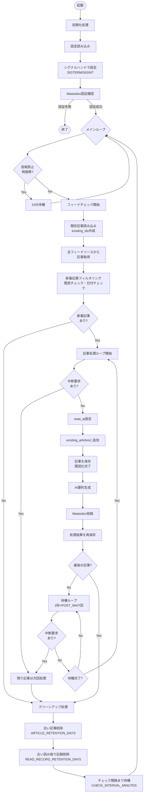
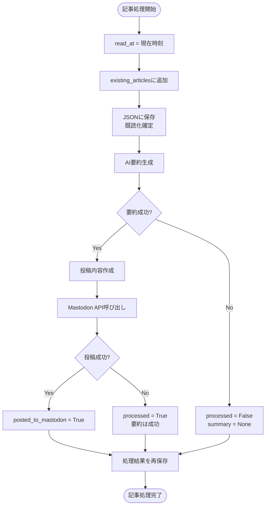
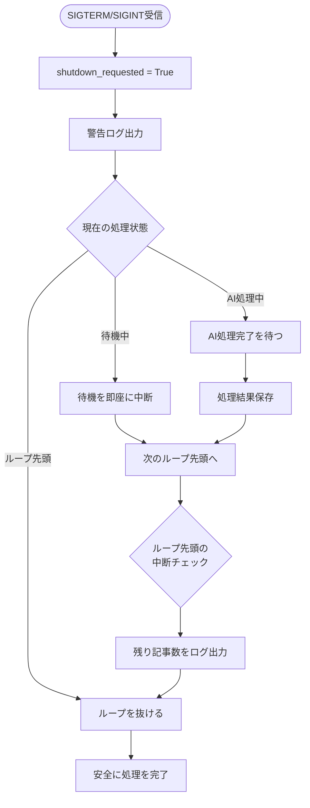
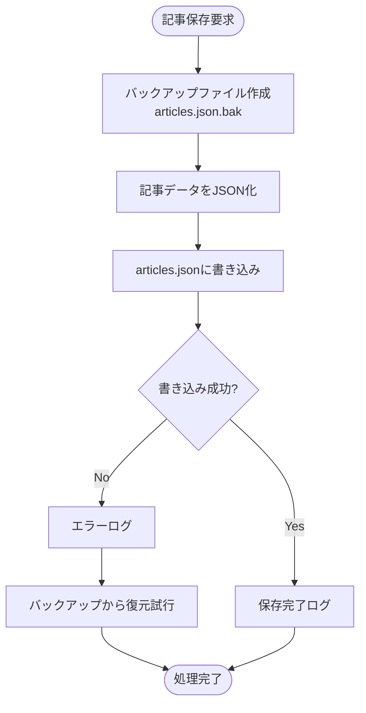
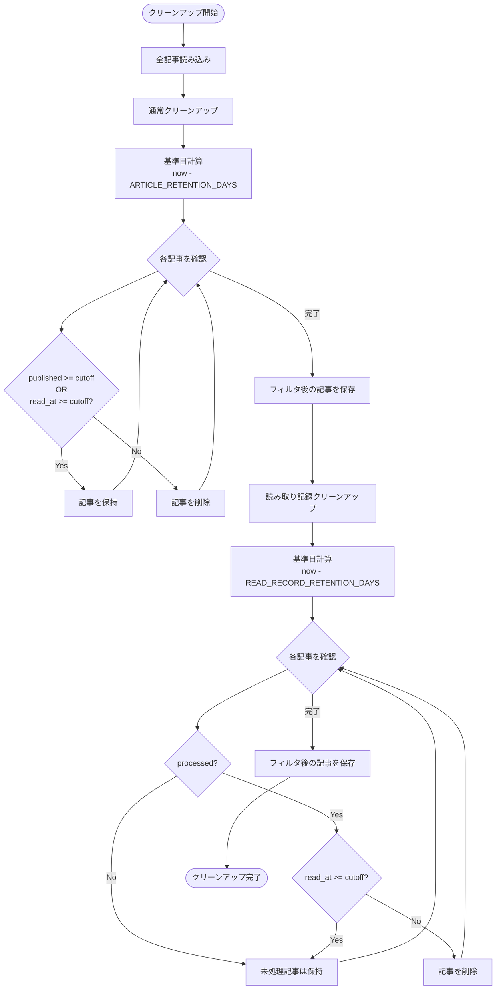

# Tsukino Feedbot フローチャート

## デーモンモード実行フロー

## 記事処理の詳細フロー

## 中断処理フロー

## データ永続化フロー

## クリーンアップ処理フロー

## 主要な設計判断

### 1. 既読管理
- **記事ID**: URLベースのハッシュで自動生成
- **既読判定**: `existing_ids` セットで高速チェック
- **既読化タイミング**: 処理直前（AI処理前）に `read_at` を設定して保存

### 2. 中断耐性
- **シグナルハンドラ**: SIGTERM/SIGINTを捕捉
- **処理中の記事**: 完了まで待機（AI処理と保存を完了）
- **次の記事**: ループ先頭で中断チェックし、未処理のまま終了
- **待機中**: 1秒単位で中断チェック

### 3. データ永続化
- **保存タイミング**: 
  - 記事追加時（既読化）
  - AI処理完了時（処理結果反映）
- **バックアップ**: 保存前に自動バックアップ作成
- **復元**: エラー時は自動復元を試行

### 4. クリーンアップ
- **二段階方式**:
  - 通常クリーンアップ（7日間保持）
  - 読み取り記録クリーンアップ（3日間保持）
- **未処理記事の保護**: processed=False の記事は削除しない

### 5. 待機処理
- **位置**: ループ制御下（_process_single_article の外）
- **分割チェック**: 1秒ごとに中断要求を確認
- **最終記事**: 待機をスキップ
